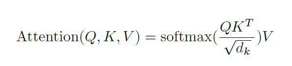

</img>

# Attention Models in Pytorch
Implementing some of the SOTA Research Papers based on Transformers and Attention in Pytorch

## Table of Contents
  * [Attention is All you Need](#attention-is-all-you-need) (Transformer)
  * [Softmax Attention](#softmax-attention) 
  * [Agent Attention](#agent-attention) 
  * [SwitchHead](#switch-head) (Accelerating transformers with Mixture Of Experts)
  * [Vision Transformer](#vision-transformer) (Image Classification Transformer)
  * [Vision Transformer MoE](#vision-transformer-with-moe) (Transformer with MoE Layer)
  * [Vector Quantised GAN](#vqgan) (VQGAN)
  * [Parti](#parti) (Google's text to image)
  * [MaskGIT](#MaskGIT) (Masked Generative Image Transformer)
  * [Muse](#Muse) (Text-To-Image Generation via Masked Generative Transformers)
  * [ViTVQGAN](#vitvqgan) (Vector-Quantised Image Modeling with Improved VQGAN)
  


## Training

```bash
python main.py --config=<path-to-cfg-file>

# Example usage 
python main.py --config=/cfg/vitvqgan.yaml
```


## Inference
See the inference folder to do inference on a specific model.

Here is an example inference for VitVQGAN.

```bash
python inference/vitvqgan.py --image car.jpg --ckpt vitvqgan.pt
```

Download the pretrained weights and try it on your custom images.

| Model                                                                                | size<br><sup>(pixels) | 
| ------------------------------------------------------------------------------------ | --------------------- | 
| [VitVQGAN](https://github.com/pranoyr/attention-models/releases/download/0.0.3/VitVQGAN.pt) | 256                   | 


##  Model Usage

### Attention is All you Need

<a href="https://arxiv.org/abs/1706.03762">Paper</a>, [Code](models/transformer.py)

```python
import torch
from models import Transformer
from einops import rearrange

transformer = Transformer(
	dim=512,
	vocab_size=1000,
	n_heads=16,
	d_head=64,
	enc_depth=6,
	dec_depth=6,
	n_classes=1000)
    
src_timesteps = 10
tgt_timesteps = 20
batch_size = 2
vocab_size = 1000

src_seq = torch.randint(1, vocab_size, (batch_size, src_timesteps)) 

# During Training -> end token should be last token in the sequence followed by padding
tgt_seq = torch.randint(1, vocab_size, (batch_size, tgt_timesteps))

# During Training -> start token should be the first token in the sequence
tgt_shifted = torch.randint(1, vocab_size, (batch_size, tgt_timesteps))

# forward pass
out = transformer(src_seq, tgt_shifted)

# compute loss
out = rearrange(out, 'b t c -> b c t')
loss = torch.nn.functional.cross_entropy(out, tgt_seq, ignore_index=0)
loss.backward()
```

### Softmax Attention

[Code](models/softmax_attention.py)

```python
import torch
from models import SoftmaxAttention

attention = SoftmaxAttention(dim=512, num_heads=16, dim_head=64)
	
x = torch.randn(2, 10, 512)  # (b, timesteps, dim)

# causal mask used in Masked Multi-Head Attention
i, j = x.shape[1], x.shape[1]
mask = torch.ones((i, j), dtype=torch.bool).triu(j - i + 1)

output = attention(x, causal_mask=mask)
print(output.shape) # (b, timesteps, dim

```

### Agent Attention

<a href="https://arxiv.org/abs/2312.08874">Paper</a>, [Code](models/agent_attention.py)

```python
import torch
from models import AgentAttention

attention = AgentAttention(dim=384, num_heads=6, dim_head=64)
	
x = torch.randn(2, 10, 384)  # (b, timesteps, dim)

output = attention(x)
print(output.shape) # (b, timesteps, dim)

```

### Switch Head

<a href="https://arxiv.org/abs/2312.07987">Paper</a>, [Code](models/switchhead_attention.py)

```python
import torch
from models.switchhead_attention import SwitchHeadAttention

attention = SwitchHeadAttention(dim=512, num_heads=2, dim_head=64, num_experts=5)
	
x = torch.randn(2, 10, 512)  # (b, timesteps, dim)
x = attention(x)
print(x.shape)
```

### Vision Transformer

<a href="https://arxiv.org/abs/2010.11929">Paper</a>, [Code](models/vit.py)

```python
import torch
from models import ViT

model = ViT(1024, image_size=256, patch_size=32, depth=6, n_heads=16, mlp_dim=2048, dropout=0.0, num_classes=1000)

img_batch = torch.randn(2, 3, 256, 256)
out = model(img_batch)
print(out.shape) # (b, num_classes)
```

### Vision Transformer with MoE

[Code](models/vit_moe.py)

```python
import torch
from models import ViTMoE

x = torch.randn(2, 3, 256, 256)
model = ViTMoE(
	dim=1024, 
	image_size=256, 
	patch_size=32,
	n_heads=16,
	d_head=64,
	depth=6, 
	n_experts=32, 
	sel_experts=2,
	dropout=0.0,
	num_classes=1000)

model.eval()
x = model(x)
print(x.shape) # torch.Size([2, 1000])
```

### Parti

<a href="https://sites.research.google/parti/">Paper</a>, [Code](models/parti.py)

```python
import torch
from models import VQGAN, Parti, ViTVQGAN

device = torch.device("cuda" if torch.cuda.is_available() else "cpu")
	
# Vector Quantizer 
vit_params = dict(
	dim=256,
	img_size=256,
	patch_size=8,
	n_heads=8,
	d_head=64,
	depth=6,
	mlp_dim=2048,
	dropout=0.1)

codebook_params = dict(codebook_size=8192, codebook_dim=32)
vitvqgan = ViTVQGAN(vit_params, codebook_params)

# Parti 
dim = 512
encoder_params = dict(
	enc_type = 'clip',
	enc_name = 'openai/clip-vit-base-patch32',
	max_length = 77
)
 
decoder_params = dict(
	n_heads=8,
	d_head=64,
	depth=6)
 
model = Parti(dim, vq=vitvqgan, **encoder_params, **decoder_params).to(device)

imgs = torch.randn(2, 3, 256, 256).to(device)
texts = ["this is a test", "this is another test"]

loss = model(texts, imgs)
loss.backward()
 
# Inference
model.eval()
with torch.no_grad():
	imgs = model.generate(texts)
print(imgs.shape)
```


### VQGAN

<a href="https://compvis.github.io/taming-transformers">Paper</a>, [Code](models/vqgan.py)

```python
import torch
from models import VQGAN

codebook_dim = 256
codebook_size = 8192

vqgan = VQGAN(codebook_dim, codebook_size)

img = torch.randn(2, 3, 256, 256)
out, loss = vqgan(img)

imgs = torch.randn(2, 3, 256, 256)
indices = vqgan.encode_imgs(imgs)
imgs = vqgan.decode_indices(indices)
print(imgs.shape)
```


### MaskGIT

<a href="https://arxiv.org/pdf/2202.04200.pdf">Paper</a>, [Code](models/maskgit.py)

```python
from torch import nn
import torch
from models import MaskGitTransformer
from einops import rearrange
from models.vqgan import VQGAN

# VQGAN
codebook_dim = 256
codebook_size = 8192
vqgan = VQGAN(codebook_dim, codebook_size)

# MaskGitTransformer
transformer = MaskGitTransformer(
	dim=512,
	vq=vqgan,
	vocab_size=codebook_size,
	n_heads=16,
	d_head=64,
	dec_depth=6)
    
imgs = torch.randn(2, 3, 256, 256)

# forward pass
loss = transformer(imgs)
loss.backward()
```


### MUSE

<a href="https://arxiv.org/pdf/2301.00704.pdf">Paper</a>, [Code](models/muse.py)

```python
from torch import nn
import torch
from einops import rearrange
from models.vqgan import VQGAN
from models import MUSE

device = torch.device("cuda" if torch.cuda.is_available() else "cpu")

# VQGAN
codebook_dim = 256
codebook_size = 8192
vq = VQGAN(codebook_dim, codebook_size)


# MUSE 
dim = 512
encoder_params = dict(
	enc_type = 'clip',
	enc_name = 'openai/clip-vit-base-patch32',
	max_length = 77
)
 
decoder_params = dict(
	n_heads=8,
	d_head=64,
	depth=6)
 
muse = MUSE(dim, vq, **encoder_params, **decoder_params).to(device)
    
imgs = torch.randn(2, 3, 256, 256).to(device)
texts = ["this is a test", "this is another test"]

# forward pass
loss = muse(texts, imgs)
loss.backward()

# generate images
imgs = muse.generate(texts)
```


### ViTVQGAN

<a href="https://arxiv.org/pdf/2110.04627.pdf">Paper</a>, [Code](models/vitvqgan.py)

```python
import torch
from models import ViTVQGAN


vit_params = dict(
	dim=512,
	img_size=256,
	patch_size=8,
	n_heads=8,
	d_head=64,
	depth=8,
	mlp_dim=2048,
	dropout=0.)

codebook_params = dict(codebook_size=8192, codebook_dim=32, beta=0.25)

imgs = torch.randn(2, 3, 256, 256)
vitvqgan = ViTVQGAN(vit_params, codebook_params)
out, loss = vitvqgan(imgs)

imgs = torch.randn(2, 3, 256, 256)
indices = vitvqgan.encode_imgs(imgs)
imgs = vitvqgan.decode_indices(indices)
print(imgs.shape)
```


## TODOs
Search for TODO Comments in the repo and contribute. 
Thank you for contributing to the repo in advance!


## Acknowledgement
- A Big Thanks to <a href="https://github.com/lucidrains">Lucidrians</a> for his open contributions. Your repos are always a reference book for me
- <a href="https://einops.rocks/">Einops</a> made my life easier
- Can't even think of Machine Learning without <a href="https://pytorch.org/"> Pytorch</a>


